# Python 数据科学手册

[返回](./index.md)

[toc]

## 第 4 章 Matplotlib数据可视化

本章将详细介绍使用 Python 的 Matplotlib 工具实现数据可视化的方法。

### 4.1 Matplotlib常用技巧

#### 4.1.1 导入Matplotlib

```python
In[1]:  import matplotlib as mpl
        import matplotlib.pyplot as plt
```

#### 4.1.2 设置绘图样式

```python
In[2]: plt.style.use('classic')
```

#### 4.1.3 用不用show()？ 如何显示图形

01. 在脚本中画图
    如果你在一个脚本文件中使用 Matplotlib， 那么显示图形的时候必须使用 `plt.show()`。
    一个 Python 会话（session） 中只能使用一次 `plt.show()`， 因此通常都把它放在脚本的最后。 多个`plt.show()` 命令会导致难以预料的显示异常。

02. 在IPython shell中画图

    在 IPython shell 中交互式地使用 Matplotlib 画图非常方便， 在 IPython 启动 Matplotlib 模式就可以使用它。

    ```python
    In [1]: %matplotlib
    Using matplotlib backend: TkAgg
    In [2]: import matplotlib.pyplot as plt
    ```

    此后的任何 plt 命令都会自动打开一个图形窗口， 增加新的命令，图形就会更新。

03. 在IPython Notebook中画图
    你可以将图形直接嵌在 IPythonNotebook 页面中， 有两种展现形式。
    * `%matplotlib notebook` 会在 Notebook 中启动交互式图形。
    * `%matplotlib inline` 会在 Notebook 中启动静态图形。
    本书统一使用 %matplotlib inline：

#### 4.1.4 将图形保存为文件

Matplotlib 的一个优点是能够将图形保存为各种不同的数据格式。

```python
In[5]: fig.savefig('my_figure.png')
```

可以用 IPython 的 Image对象来显示文件内容：

```python
In[7]: from IPython.display import Image
Image('my_figure.png')
```

在 savefig() 里面， 保存的图片文件格式就是文件的扩展名。你可以通过 canvas 对象的方法查看系统支持的文件格式：

```python
In[8]: fig.canvas.get_supported_filetypes()
Out[8]:{'eps': 'Encapsulated Postscript',
        'jpeg': 'Joint Photographic Experts Group',
        'jpg': 'Joint Photographic Experts Group',
        'pdf': 'Portable Document Format',
        'pgf': 'PGF code for LaTeX',
        'png': 'Portable Network Graphics',
        'ps': 'Postscript',
        'raw': 'Raw RGBA bitmap',
        'rgba': 'Raw RGBA bitmap',
        'svg': 'Scalable Vector Graphics',
        'svgz': 'Scalable Vector Graphics',
        'tif': 'Tagged Image File Format',
        'tiff': 'Tagged Image File Format'}
```

当你保存图形文件时， 不需要使用 plt.show() 或者前面介绍过的命令。

### 4.2 两种画图接口

Matplotlibe有两种画图接口：一个是便捷的 MATLAB 风格接口， 另一个是功能更强大的面向对象接口。

#### 4.2.1 MATLAB风格接口

```python
In[9]:  plt.figure() # 创建图形
        # 创建两个子图中的第一个， 设置坐标轴
        plt.subplot(2, 1, 1) # (行、 列、 子图编号)
        plt.plot(x, np.sin(x))

        # 创建两个子图中的第二个， 设置坐标轴
        plt.subplot(2, 1, 2)
        plt.plot(x, np.cos(x))
```

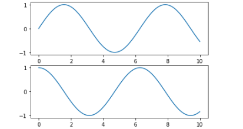

这种接口最重要的特性是有状态的（stateful） ： 它会持续跟踪“当前的”图形和坐标轴， 所有 plt 命令都可以应用。

#### 4.2.2 面向对象接口

面向对象接口可以适应更复杂的场景， 更好地控制你自己的图形。

```python
In[10]: # 先创建图形网格
        # ax是一个包含两个Axes对象的数组
        fig, ax = plt.subplots(2)

        # 在每个对象上调用plot()方法
        ax[0].plot(x, np.sin(x))
        ax[1].plot(x, np.cos(x))
```

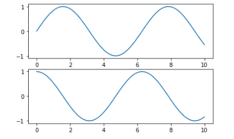

### 4.3 简易线形图

```python
In[1]:  %matplotlib inline
        # 导入必须的库
        import matplotlib.pyplot as plt
        plt.style.use('seaborn-whitegrid')
        import numpy as np
```

```python
        # 创建一个图形 fig 和一个坐标轴ax
In[2]:  fig = plt.figure()
        ax = plt.axes()
```


```python
        # 一组简单的正弦曲线（sinusoid）
In[3]:  fig = plt.figure()
        ax = plt.axes()
        x = np.linspace(0, 10, 1000)
        ax.plot(x, np.sin(x))
```


```python
        # 也可以用 pylab 接口画图
In[4]:  plt.plot(x, np.sin(x))
```


```python
        # 如果想在一张图中创建多条线， 可以重复调用 plot 命令
In[5]:  plt.plot(x, np.sin(x))
        plt.plot(x, np.cos(x))
```


#### 4.3.1 调整图形： 线条的颜色与风格

`plt.plot()` 函数可以通过相应的参数设置颜色与风格。

```python
In[6]:
plt.plot(x, np.sin(x - 0), color='blue') # 标准颜色名称
plt.plot(x, np.sin(x - 1), color='g') # 缩写颜色代码（rgbcmyk）
plt.plot(x, np.sin(x - 2), color='0.75') # 范围在0~1的灰度值
plt.plot(x, np.sin(x - 3), color='#FFDD44') # 十六进制（RRGGBB， 00~FF）
plt.plot(x, np.sin(x - 4), color=(1.0,0.2,0.3)) # RGB元组， 范围在0~1
plt.plot(x, np.sin(x - 5), color='chartreuse'); # HTML颜色名称
```

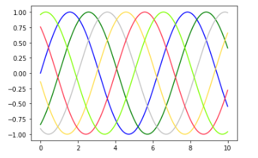

也可以用 linestyle 调整线条的风格

```python
In[7]:  plt.plot(x, x + 0, linestyle='solid')
        plt.plot(x, x + 1, linestyle='dashed')
        plt.plot(x, x + 2, linestyle='dashdot')
        plt.plot(x, x + 3, linestyle='dotted')

        # 你可以用下面的简写形式
        plt.plot(x, x + 4, linestyle='-') # 实线
        plt.plot(x, x + 5, linestyle='--') # 虚线
        plt.plot(x, x + 6, linestyle='-.') # 点划线
        plt.plot(x, x + 7, linestyle=':'); # 实点线
```

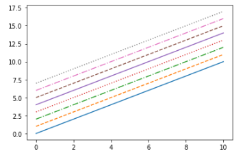

可以将 linestyle 和 color 编码组合起来

```python
In[8]:  plt.plot(x, x + 0, '-g') # 绿色实线
        plt.plot(x, x + 1, '--c') # 青色虚线
        plt.plot(x, x + 2, '-.k') # 黑色点划线
        plt.plot(x, x + 3, ':r'); # 红色实点线
```


#### 4.3.2 调整图形： 坐标轴上下限

调整坐标轴上下限最基础的方法是`plt.xlim()` 和 `plt.ylim()`

```python
In[9]: plt.plot(x, np.sin(x))
plt.xlim(-1, 11)
plt.ylim(-1.5, 1.5)
```

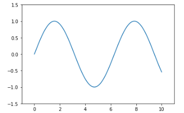

也可以逆序设置坐标轴刻度值

```python
In[10]: plt.plot(x, np.sin(x))
        plt.xlim(10, 0)
        plt.ylim(1.2, -1.2)
```

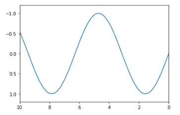

还有一个方法是 `plt.axis()`

```python
In[11]: plt.plot(x, np.sin(x))
        plt.axis([-1, 11, -1.5, 1.5])
```


`plt.axis()` 还可以按照图形的内容自动收紧坐标轴， 不留空白区域

```python
In[12]: plt.plot(x, np.sin(x))
        plt.axis('tight')
```

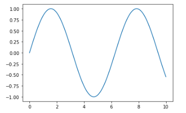

你还可以实现更高级的配置， 例如让屏幕上显示的图形分辨率为 1:1

```python
In[13]: plt.plot(x, np.sin(x))
        plt.axis('equal')
```

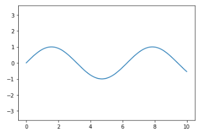

#### 4.3.3 设置图形标签

快速设置图形标题与坐标轴标题

```python
In[14]: plt.plot(x, np.sin(x))
plt.title("A Sine Curve")
plt.xlabel("x")
plt.ylabel("sin(x)")
```


Matplotlib 内置了一个简单快速的方法， 可以用来创建图例， 那就是 `plt.legend()`

```python
In[15]: plt.plot(x, np.sin(x), '-g', label='sin(x)')
        plt.plot(x, np.cos(x), ':b', label='cos(x)')
        plt.axis('equal')
        plt.legend()
```

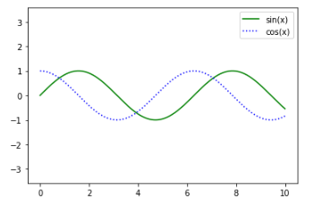

虽然绝大多数的 plt 函数都可以直接转换成 ax 方法（例如`plt.plot()` → `ax.plot()`、 `plt.legend()` → `ax.legend()`等） ， 但是并非所有的命令都可以这样用。 尤其是用来设置坐标轴上下限、 坐标轴标题和图形标题的函数， 它们大都稍有差别。 一些MATLAB 风格的方法和面向对象方法的转换如下所示：

* plt.xlabel() → ax.set_xlabel()
* plt.ylabel() → ax.set_ylabel()
* plt.xlim() → ax.set_xlim()
* plt.ylim() → ax.set_ylim()
* plt.title() → ax.set_title()

采用ax.set() 方法一次性设置所有的属性是更简便的方法

```python
In[16]: ax = plt.axes()
        ax.plot(x, np.sin(x))
        ax.set(xlim=(0, 10), ylim=(-2, 2),
        xlabel='x', ylabel='sin(x)',
        title='A Simple Plot')
```


### 4.4 简易散点图

#### 4.4.1 用plt.plot画散点图

```python
In[2]:  x = np.linspace(0, 10, 30)
        y = np.sin(x)
        plt.plot(x, y, 'o', color='black');
```

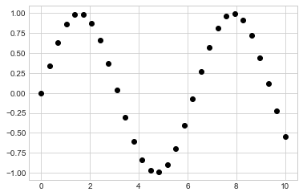

函数画出来折线图或散点图由函数的第三个参数决定， 这是一个字符， 表示线条类型或图形符号的类型。
下面是部分图形符号类型

```python
In[3]:  rng = np.random.RandomState(0)
        for marker in ['o', '.', ',', 'x', '+', 'v', '^', '<', '>', 's', 'd']:
            plt.plot(rng.rand(5), rng.rand(5), marker,
                    label="marker='{0}'".format(marker))
            plt.legend(numpoints=1)
            plt.xlim(0, 1.8);
```

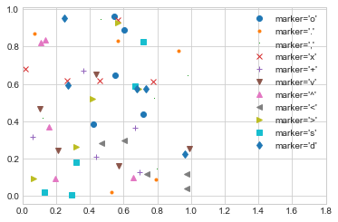

还可以将线条、 颜色代码组合起来， 画出一条连接散点的线

```python
In[4]: plt.plot(x, y, '-ok'); # 直线（-） 、 圆圈（o） 、 黑色（k）
```

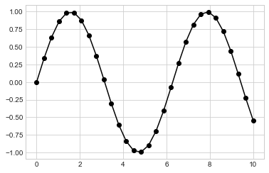

plt.plot 支持许多设置线条和散点属性的参数

```python
In[5]:  plt.plot(x, y, '-p', color='gray',
            markersize=15, linewidth=4,
            markerfacecolor='white',
            markeredgecolor='gray',
            markeredgewidth=2)
        plt.ylim(-1.2, 1.2);
```


#### 4.4.2 用plt.scatter画散点图

另一个可以创建散点图的函数是 plt.scatter。

```python
In[6]: plt.scatter(x, y, marker='o');
```

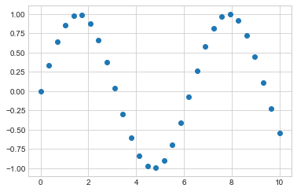

plt.scatter 与 plt.plot 的主要差别在于， 前者在创建散点图时具有更高的灵活性， 可以单独控制每个散点与数据匹配， 也可以让每个散点具有不同的属性（大小、 表面颜色、 边框颜色等） 。

```python
In[7]:  rng = np.random.RandomState(0)
        x = rng.randn(100)
        y = rng.randn(100)
        colors = rng.rand(100)
        sizes = 1000 * rng.rand(100)
        plt.scatter(x, y, c=colors, s=sizes, alpha=0.3,
                    cmap='viridis')
        plt.colorbar(); # 显示颜色条
```


颜色自动映射成颜色条（color scale， 通过 colorbar() 显示） ， 散点的大小以像素为单位。 这样， 散点的颜色与大小就可以在可视化图中显示多维数据的信息了。

#### 4.4.3 plot与scatter： 效率对比

在数据量较小的时候， 两者在效率上的差异不大。 但是当数据变大到几千个散点时， plt.plot 的效率将大大高于plt.scatter。这是由于 plt.scatter 会对每个散点进行单独的大小与颜色的渲染， 因此渲染器会消耗更多的资源。 而在 plt.plot 中， 散点基本都彼此复制， 因此整个数据集中所有点的颜色、 尺寸只需要配置一次。 

### 4.5 可视化异常处理

对任何一种科学测量方法来说， 准确地衡量数据误差都是无比重要的事情， 甚至比数据本身还要重要。
在数据可视化的结果中用图形将误差有效地显示出来， 就可以提供更充分的信息。

#### 4.5.1 基本误差线

```python
In[1]:  %matplotlib inline
        import matplotlib.pyplot as plt
        plt.style.use('seaborn-whitegrid')
        import numpy as np
In[2]:  x = np.linspace(0, 10, 50)
        dy = 0.8
        y = np.sin(x) + dy * np.random.randn(50)
        plt.errorbar(x, y, yerr=dy, fmt='.k')
```

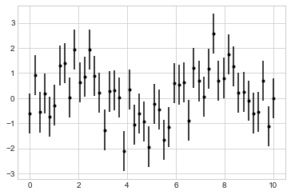

其中， fmt 是一种控制线条和点的外观的代码格式，语法与 plt.plot的缩写代码相同。

errorbar 还有许多改善结果的选项。 通过这些额外的选项， 你可以轻松自定义误差线图形的绘画风格。
让误差线的颜色比数据点的颜色浅一点效果会非常好， 尤其是在那些比较密集的图形中。

```python
In[3]: plt.errorbar(x, y, yerr=dy, fmt='o', color='black',
                    ecolor='lightgray', elinewidth=3, capsize=0);
```


#### 4.5.2 连续误差

有时候可能需要显示连续变量的误差。 虽然 Matplotlib 没有内置的简便方法可以解决这个问题， 但是通过 plt.plot 与 plt.fill_between 来解决也不是很难。

```python
In[4]:  from sklearn.gaussian_process import GaussianProcess

        # 定义模型和要画的数据
        model = lambda x: x * np.sin(x)
        xdata = np.array([1, 3, 5, 6, 8])
        ydata = model(xdata)

        # 计算高斯过程拟合结果
        gp = GaussianProcess(corr='cubic', theta0=1e-2, thetaL=1e-4, thetaU=1E-1,
                            random_start=100)
        gp.fit(xdata[:, np.newaxis], ydata)

        xfit = np.linspace(0, 10, 1000)
        yfit, MSE = gp.predict(xfit[:, np.newaxis], eval_MSE=True)
        dyfit = 2 * np.sqrt(MSE) # 2*sigma~95%置信区间
```

```python
In[5]:  # 将结果可视化
        plt.plot(xdata, ydata, 'or')
        plt.plot(xfit, yfit, '-', color='gray')
        plt.fill_between(xfit, yfit - dyfit, yfit + dyfit,
                        color='gray', alpha=0.2)
        plt.xlim(0, 10);
```

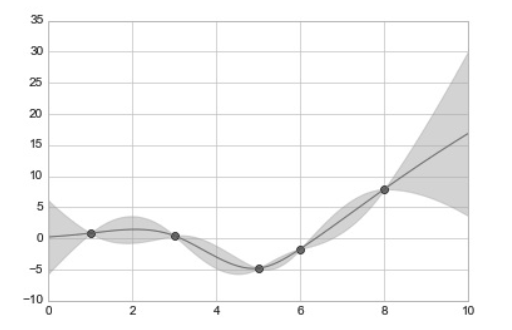

### 4.6 密度图与等高线图

有时在二维图上用等高线图或者彩色图来表示三维数据是个不错的方法。 Matplotlib 提供了三个函数来解决这个问题： 用 plt.contour 画等高线图、 用 plt.contourf 画带有填充色的等高线图（filled contourplot） 的色彩、 用 plt.imshow 显示图形。

将 plt.contour、 plt.contourf 与 plt.imshow 这三个函数组合起来
之后， 就打开了用二维图画三维数据的无尽可能。

### 4.7 频次直方图、 数据区间划分和分布密度

```python
In[3]: plt.hist(data, bins=30, normed=True, alpha=0.5,
                histtype='stepfilled', color='steelblue',
                edgecolor='none')
```

如果你只需要简单地计算频次直方图（就是计算每段区间的样本数） ，而并不想画图显示它们， 那么可以直接用 np.histogram()：

```python
In[5]:  counts, bin_edges = np.histogram(data, bins=5)
        print(counts)
[ 12 190 468 301 29]
```

#### 二维频次直方图与数据区间划分

我们可以将二维数组按照二维区间进行切分， 来创建二维频次直方图。

用一个多元高斯分布（multivariate Gaussian distribution） 生成 x 轴与 y 轴的样本数据：

```python
In[6]:  mean = [0, 0]
        cov = [[1, 1], [1, 2]]
        x, y = np.random.multivariate_normal(mean, cov, 10000)
```

01. plt.hist2d： 二维频次直方图

    ```python
    In[12]: plt.hist2d(x, y, bins=30, cmap='Blues')
    cb = plt.colorbar()
    cb.set_label('counts in bin')
    ```

    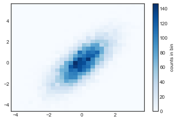

    plt.hist2d 类似的函数是 np.histogram2d

02. plt.hexbin： 六边形区间划分

    ```python
    In[9]:  plt.hexbin(x, y, gridsize=30, cmap='Blues')
            cb = plt.colorbar(label='count in bin')
    ```

    

03. 核密度估计

    还有一种评估多维数据分布密度的常用方法是核密度估计（kernel density estimation， KDE） 。

### 4.8 配置图例

想在可视化图形中使用图例， 可以为不同的图形元素分配标签。 

可以用 plt.legend() 命令来创建最简单的图例， 它会自动创建一个包含每个图形元素的图例：

```python
In[1]:  import matplotlib.pyplot as plt
        plt.style.use('classic')
        In[2]: %matplotlib inline
import numpy as np
In[3]:  x = np.linspace(0, 10, 1000)
        fig, ax = plt.subplots()
        ax.plot(x, np.sin(x), '-b', label='Sine')
        ax.plot(x, np.cos(x), '--r', label='Cosine')
        ax.axis('equal')
        leg = ax.legend();
```


通过修改`plt.legend()`的参数， 我们可以对图例进行各种个性化的配置。如： 设置图例的位置， 并取消外边框；用 ncol 参数设置图例的标签列数；为图例定义圆角边框（fancybox） 、 增加阴影、 改变外边框透明度（framealpha 值） ， 或者改变文字间距等等

#### 4.8.1 选择图例显示的元素

你可以通过一些图形命令来指定显示图例中的哪些元素和标签。

plt.plot() 命令可以一次创建多条线， 返回线条实例列表。 一种方法是将需要显示的线条传入 plt.legend()， 另一种方法是只为需要在图例中显示的线条设置标签（如图 4-45 所示） ：

```python
In[7]:  y = np.sin(x[:, np.newaxis] + np.pi * np.arange(0, 2, 0.5))
        lines = plt.plot(x, y)
        # lines变量是一组plt.Line2D实例
        plt.legend(lines[:2], ['first', 'second']);

In[8]:  plt.plot(x, y[:, 0], label='first')
        plt.plot(x, y[:, 1], label='second')
        plt.plot(x, y[:, 2:])
        plt.legend(framealpha=1, frameon=True)
```


#### 4.8.2 在图例中显示不同尺寸的点

有时， 默认的图例仍然不能满足我们的可视化需求。 例如， 你可能需要用不同尺寸的点来表示数据的特征， 并且希望创建这样的图例来反映这些特征。 下面的示例将用点的尺寸来表明美国加州不同城市的人口数量。 如果我们想要一个通过不同尺寸的点显示不同人口数量级的图例，可以通过隐藏一些数据标签来实现这个效果 ：

```python
In[9]:  import pandas as pd
        cities = pd.read_csv('data/california_cities.csv')

        # 提取感兴趣的数据
        lat, lon = cities['latd'], cities['longd']
        population, area = cities['population_total'], cities['area_total_km2']

        # 用不同尺寸和颜色的散点图表示数据， 但是不带标签
        plt.scatter(lon, lat, label=None,
                    c=np.log10(population), cmap='viridis',
                    s=area, linewidth=0, alpha=0.5)
        plt.axis(aspect='equal')
        plt.xlabel('longitude')
        plt.ylabel('latitude')
        plt.colorbar(label='log$_{10}$(population)')
        plt.clim(3, 7)

        # 下面创建一个图例：
        # 画一些带标签和尺寸的空列表
        for area in [100, 300, 500]:
            plt.scatter([], [], c='k', alpha=0.3, s=area,
                        label=str(area) + ' km$^2$')
        plt.legend(scatterpoints=1, frameon=False,
                    labelspacing=1, title='City Area')

        plt.title('California Cities: Area and Population');
```


#### 4.8.3 同时显示多个图例

为通过标准的 legend 接口只能为一张图创建一个图例。

我们可以通过从头开始创建一个新的图例艺术家对象（legend artist） ， 然后用底层的（lowerlevel） ax.add_artist() 方法在图上添加第二个图例：

```python
In[10]: fig, ax = plt.subplots()

        lines = []
        styles = ['-', '--', '-.', ':']
        x = np.linspace(0, 10, 1000)

        for i in range(4):
            lines += ax.plot(x, np.sin(x - i * np.pi / 2),
                            styles[i], color='black')
        ax.axis('equal')

        # 设置第一个图例要显示的线条和标签
        ax.legend(lines[:2], ['line A', 'line B'],
                    loc='upper right', frameon=False)

        # 创建第二个图例， 通过add_artist方法添加到图上
        from matplotlib.legend import Legend
        leg = Legend(ax, lines[2:], ['line C', 'line D'],
                    loc='lower right', frameon=False)
        ax.add_artist(leg);
```


### 4.9 配置颜色条

```python
In[1]:  import matplotlib.pyplot as plt
        plt.style.use('classic')
In[2]:  %matplotlib inline
        import numpy as np
In[3]:  x = np.linspace(0, 10, 1000)
        I = np.sin(x) * np.cos(x[:, np.newaxis])
        plt.imshow(I)
        plt.colorbar();
```


#### 4.9.1 配置颜色条

可以通过 cmap 参数为图形设置颜色条的配色方案

```python
In[4]: plt.imshow(I, cmap='gray');

```


所有可用的配色方案都在 plt.cm 命名空间里面， 在 IPython 里通过Tab 键就可以查看所有的配置方案：

```python
plt.cm.<TAB>
```

01. 选择配色方案
    一般情况下， 你只需要重点关注三种不同的配色方案（例如 binary 或viridis） 。
    * 顺序配色方案：由一组连续的颜色构成的配色方案（例如 binary 或viridis） 。
    * 互逆配色方案：通常由两种互补的颜色构成， 表示正反两种含义（例如 binary 或viridis） 。
    * 定性配色方案：随机顺序的一组颜色（例如 binary 或viridis） 。
02. 颜色条刻度的限制与扩展功能的设置
03. 离散型颜色条
    虽然颜色条默认都是连续的， 但有时你可能也需要表示离散数据。最简单的做法就是使用 plt.cm.get_cmap() 函数， 将适当的配色方案的名称以及需要的区间数量传进去即可

    ```python
    In[11]: plt.imshow(I, cmap=plt.cm.get_cmap('Blues', 6))
            plt.colorbar()
            plt.clim(-1, 1);
    ```

    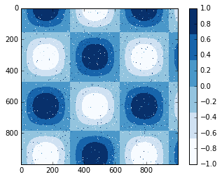

#### 4.9.2 案例： 手写数字

### 4.10 多子图

有时候需要从多个角度对数据进行对比。 Matplotlib 为此提出了子图（subplot） 的概念： 在较大的图形中同时放置一组较小的坐标轴。 这些子图可能是画中画（inset） 、 网格图（grid of plots） ， 或者是其他更复杂的布局形式。

#### 4.10.1 plt.axes： 手动创建子图

创建坐标轴最基本的方法就是使用 `plt.axes` 函数。
`plt.axes` 第一个参数的四个值分别是 `[left, bottom, width, height]`

```python
In[2]:  ax1 = plt.axes() # 默认坐标轴
        ax2 = plt.axes([0.65, 0.65, 0.2, 0.2])
```


面向对象画图接口中类似的命令有 fig.add_axes()。 用这个命令创建两个竖直排列的坐标轴：

```python
In[3]:  fig = plt.figure()
        ax1 = fig.add_axes([0.1, 0.5, 0.8, 0.4],
                            xticklabels=[], ylim=(-1.2, 1.2))
        ax2 = fig.add_axes([0.1, 0.1, 0.8, 0.4],
                            ylim=(-1.2, 1.2))
        x = np.linspace(0, 10)
        ax1.plot(np.sin(x))
        ax2.plot(np.cos(x));
```

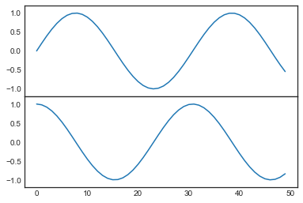

#### 4.10.2 plt.subplot： 简易网格子图

若干彼此对齐的行列子图是常见的可视化任务， 最底层的方法是用 plt.subplot() 在一个网格中创建一个子图。 这个命令有三个整型参数——将要创建的网格子图行数、 列数和索引值， 索引值从 1 开始， 从左上角到右下角依次增大

```python
In[4]:  for i in range(1, 7):
            plt.subplot(2, 3, i)
            plt.text(0.5, 0.5, str((2, 3, i)),
                    fontsize=18, ha='center')
```

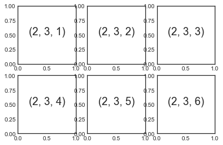


plt.subplots_adjust 命令可以调整子图之间的间隔。 用面向对象接口的命令 fig.add_subplot() 可以取得同样的效果

```python
In[5]:  fig = plt.figure()
        fig.subplots_adjust(hspace=0.4, wspace=0.4)
        for i in range(1, 7):
            ax = fig.add_subplot(2, 3, i)
            ax.text(0.5, 0.5, str((2, 3, i)),
                    fontsize=18, ha='center')
```


#### 4.10.3 plt.subplots： 用一行代码创建网格

当你打算创建一个大型网格子图时， 尤其是当你想隐藏内部子图的 x 轴与 y 轴标题时。 plt.subplots() 实现了你想要的功能（需要注意此处 subplots结尾多了个 s） 。 这个函数用一行代码创建多个子图， 并返回一个包含子图的 NumPy 数组。 关键参数是行数与列数， 以及可选参数 sharex 与 sharey， 通过它们可以设置不同子图之间的关联关系

```python
In[6]: fig, ax = plt.subplots(2, 3, sharex='col', sharey='row')
```


设置 sharex 与 sharey 参数之后， 我们就可以自动去掉网格内部子图的标签， 让图形看起来更整洁。
可以通过标准的数组取值方获取想要的坐标轴

```python
In[7]:  # 坐标轴存放在一个NumPy数组中， 按照[row, col]取值
        for i in range(2):
            for j in range(3):
                ax[i, j].text(0.5, 0.5, str((i, j)),
                                fontsize=18, ha='center')
        fig
```


#### 4.10.4 plt.GridSpec： 实现更复杂的排列方式

如果想实现不规则的多行多列子图网格， plt.GridSpec() 是最好的工具。 plt.GridSpec() 对象本身不能直接创建一个图形， 它只是plt.subplot() 命令可以识别的简易接口。

```python
In[8]:  grid = plt.GridSpec(2, 3, wspace=0.4, hspace=0.3)
In[9]:  plt.subplot(grid[0, 0])
        plt.subplot(grid[0, 1:])
        plt.subplot(grid[1, :2])
        plt.subplot(grid[1, 2]);
```


#### 4.11 文字与注释

可以通过 plt.text/ax.text 命令手动添加注释， 它们
可以在具体的 x / y 坐标点上放上文字
ax.text 方法需要一个 x 轴坐标、 一个 y 轴坐标、 一个字符串和一些可
选参数， 比如文字的颜色、 字号、 风格、 对齐方式以及其他文字属性。如 `ax.text('2012-1-1', 3950, "New Year's Day", **style)`

#### 4.11.2 坐标变换与文字位置

有时候可能需要将文字放在与数据无关的位置上， 比如坐标轴或者图形中。 在 Matplotlib 中，我们通过调整坐标变换（transform） 来实现。

ax.transData 以数据为基准的坐标变换。
ax.transAxes 以坐标轴为基准的坐标变换（以坐标轴维度为单位） 。
fig.transFigure 以图形为基准的坐标变换（以图形维度为单位） 。

```python
In[10]: fig, ax = plt.subplots(facecolor='lightgray')
        ax.axis([0, 10, 0, 10])
        # 虽然transform=ax.transData是默认值， 但还是设置一下
        ax.text(1, 5, ". Data: (1, 5)", transform=ax.transData)
        ax.text(0.5, 0.1, ". Axes: (0.5, 0.1)", transform=ax.transAxes)
        ax.text(0.2, 0.2, ". Figure: (0.2, 0.2)", transform=fig.transFigure)
Out[10]:Text(0.2, 0.2, '. Figure: (0.2, 0.2)')
```

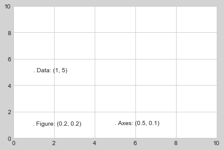
对比 Matplotlib 的三种坐标系

transData 坐标用 x 轴与 y 轴的标签作为数据坐标。 transAxes 坐标以坐标轴（图中白色矩形） 左下角的位置为原点， 按坐标轴尺寸的比例呈现坐标。 transFigure 坐标与之类似， 不过是以图形（图中灰色矩形） 左下角的位置为原点， 按图形尺寸的比例呈现坐标。

#### 4.11.3 箭头与注释

在 Matplotlib 里面画箭头通常比你想象的要困难。 虽然有一个plt.arrow() 函数可以实现这个功能， 但是它创建出的箭头是 SVG 向量图对象， 会随着图形分辨率的变化而改变，最终的结果可能完全不是用户想要的。 推荐用 plt.annotate()函数。 这个函数既可以创建文字， 也可以创建箭头， 而且它创建的箭头能够进行非常灵活的配置。

```python
In[11]: %matplotlib inline
        fig, ax = plt.subplots()
        x = np.linspace(0, 20, 1000)
        ax.plot(x, np.cos(x))
        ax.axis('equal')
        ax.annotate('local maximum', xy=(6.28, 1), xytext=(10, 4),
        arrowprops=dict(facecolor='black', shrink=0.05))
        ax.annotate('local minimum', xy=(5 * np.pi, -1), xytext=(2, -6),
        arrowprops=dict(arrowstyle="->",connectionstyle="angle3,angleA=0,angleB=-90"))
```

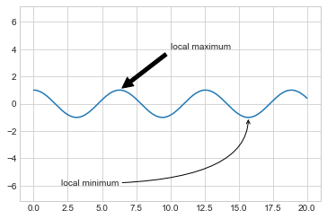

箭头的风格是通过 arrowprops 字典控制的， 里面有许多可用的选项。这些选项在 Matplotlib 的官方文档中都有非常详细的介绍。

### 4.12 自定义坐标轴刻度

本节将通过一些示例演示如何将坐标轴刻度调整为你需要的位置与格式。

Matplotlib 的目标是用 Python 对象表现任意图形元素。 例如， 想想前面介绍的 figure 对象， 它其实就是一个盛放图形元素的包围盒（bounding box） 。 可以将每个 Matplotlib 对象都看成是子对象（subobject） 的容器， 例如每个 figure 都会包含一个或多个 axes 对象， 每个 axes 对象又会包含其他表示图形内容的对象。

#### 4.12.1 主要刻度与次要刻度

每一个坐标轴都有主要刻度线与次要刻度线。 顾名思义， 主要刻度往往更大或更显著， 而次要刻度往往更小。

```python
In[12]: ax = plt.axes(xscale='log', yscale='log')
```

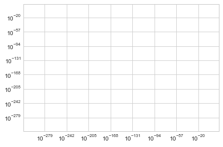

#### 4.12.2 隐藏刻度与标签

最常用的刻度 / 标签格式化操作可能就是隐藏刻度与标签了， 可以通过plt.NullLocator() 与 plt.NullFormatter() 实现

```python
In[13]: ax = plt.axes()
        ax.plot(np.random.rand(50))
        ax.yaxis.set_major_locator(plt.NullLocator())
        ax.xaxis.set_major_formatter(plt.NullFormatter())
```

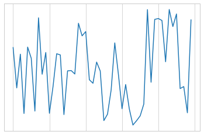

在许多场景中都不需要刻度线， 比如当你想要显示一组图形时。

#### 4.12.3 增减刻度数量

默认刻度标签有一个问题， 就是显示较小图形时， 通常刻度显得十分拥挤。 我们可以用plt.MaxNLocator() 来解决这个问题， 通过它可以设置最多需要显示多少刻度。

#### 4.12.4 花哨的刻度格式

通过设置一个 MultipleLocator， 它可以将刻度放在你提供的数值的倍数上。
用plt.FuncFormatter 可以用一个自定义的函数设置不同刻度标签的显示。

#### 4.12.5 格式生成器与定位器小结

| 定位器类 | 描述 |
| ---- | ---- |
| NullLocator | 无刻度 |
| FixedLocator | 刻度位置固定 |
| IndexLocator | 用索引作为定位器（如 x = range(len(y))）|
| LinearLocator | 从 min 到 max 均匀分布刻度 |
| LogLocator | 从 min 到 max 按对数分布刻度 |
| MultipleLocator | 刻度和范围都是基数（base）的倍数 |
| MaxNLocator | 为最大刻度找到最优位置 |
| AutoLocator | （默认） 以 MaxNLocator 进行简单配置 |
| AutoMinorLocator | 次要刻度的定位器 |

| 格式生成器类 | 描述 |
| ---- | ---- |
| NullFormatter | 刻度上无标签 |
| IndexFormatter | 将一组标签设置为字符串 |
| FixedFormatter | 手动为刻度设置标签 |
| FuncFormatter | 用自定义函数设置标签 |
| FormatStrFormatter | 为每个刻度值设置字符串格式 |
| ScalarFormatter | （默认） 为标量值设置标签 |
| LogFormatter | 对数坐标轴的默认格式生成器 |

### 4.13 Matplotlib自定义:配置文件与样式表

#### 4.13.1 手动配置图形

原始图形

```python
In[14]: x = np.random.randn(1000) 
        plt.hist(x);
```


自定义图形样式

```python
# 用灰色背景
In[15]: ax = plt.axes(facecolor='#E6E6E6') 
        ax.set_axisbelow(True)
        # 画上白色的网格线
        plt.grid(color='w', linestyle='solid')
        # 隐藏坐标轴的线条
        for spine in ax.spines.values():
            spine.set_visible(False)
        # 隐藏上边与右边的刻度 
        ax.xaxis.tick_bottom() 
        ax.yaxis.tick_left()
        # 弱化刻度与标签
        ax.tick_params(colors='gray', direction='out') 
        for tick in ax.get_xticklabels():
            tick.set_color('gray')
        for tick in ax.get_yticklabels():
            tick.set_color('gray')
        # 设置频次直方图轮廓色与填充色
        ax.hist(x, edgecolor='#E6E6E6', color='#EE6666');
```


#### 4.13.2 修改默认配置:rcParams

Matplotlib 每次加载时，都会定义一个运行时配置(rc)，其中包含了 所有你创建的图形元素的默认风格。你可以用 plt.rc 简便方法随时修 改这个配置。

```python
In[16]: from matplotlib import cycler
        colors = cycler('color',
                ['#EE6666', '#3388BB', '#9988DD', '#EECC55', '#88BB44', '#FFBBBB'])
        plt.rc('axes', facecolor='#E6E6E6', edgecolor='none', axisbelow=True, grid=True, prop_cycle=colors)
        plt.rc('grid', color='w', linestyle='solid')
        plt.rc('xtick', direction='out', color='gray')
        plt.rc('ytick', direction='out', color='gray')
        plt.rc('patch', edgecolor='#E6E6E6')
        plt.rc('lines', linewidth=2)
```

画一些线图看看 rc 参数的效果

```python
In[16]: for i in range(4):
            plt.plot(np.random.rand(10))
```


#### 4.13.3 样式表

2014 年 8 月发布的 Matplotlib 1.4 版本中增加了一个非常好用的 style 模块，里面包含了大量的新式默认样式表，还支持创建和打包你自己的 风格。虽然这些样式表实现的格式功能与前面介绍的 .matplotlibrc 文件 类似，但是它的文件扩展名是 .mplstyle。

使用某种样式表的基本方法: `plt.style.use('stylename')`
也可以使用 风格上下文管理器(context manager)临时更换至另一种风格:

```python
with plt.style.context('stylename'): 
    make_a_plot()
```

### 4.14 用Matplotlib画三维图

我们可以导入 Matplotlib 自带的 mplot3d 工具箱来画三维图:

```python
 In[17]: from mpl_toolkits import mplot3d
 ```

 导入这个子模块之后，就可以在创建任意一个普通坐标轴的过程中加入 projection='3d' 关键字，从而创建一个三维坐标轴:

```python
In[18]: fig = plt.figure()
            ax = plt.axes(projection='3d')
```

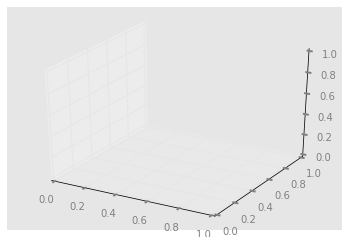

#### 4.14.1 三维数据点与线

最基本的三维图是由 (x , y , z ) 三维坐标点构成的线图与散点图。与前面 介绍的普通二维图类似，可以用 ax.plot3D 与 ax.scatter3D 函数来 创建它们。
下面来画一个三角螺旋线(trigonometric spiral)，在线上随机分 布一些散点(如图 4-93 所示):

```python
In[19]: ax = plt.axes(projection='3d')
        # 三维线的数据
        zline = np.linspace(0, 15, 1000) 
        xline = np.sin(zline)
        yline = np.cos(zline) 
        ax.plot3D(xline, yline, zline, 'gray')
        # 三维散点的数据
        zdata = 15 * np.random.random(100)
        xdata = np.sin(zdata) + 0.1 * np.random.randn(100)
        ydata = np.cos(zdata) + 0.1 * np.random.randn(100) 
        ax.scatter3D(xdata, ydata, zdata, c=zdata, cmap='Greens');
```

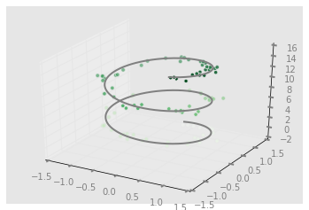

#### 4.14.2 三维等高线图

与 4.6 节介绍的等高线类似，mplot3d 也有用同样的输入数据创建三维 晕渲(relief)图的工具。下面演示一个用三维正弦函数画的三维等高线图:


```python
In[20]: def f(x, y):
            return np.sin(np.sqrt(x ** 2 + y ** 2))

In[21]: x = np.linspace(-6, 6, 30) 
        y = np.linspace(-6, 6, 30)
        X, Y = np.meshgrid(x, y) 
        Z = f(X, Y)

In[22]: fig = plt.figure()
        ax = plt.axes(projection='3d') 
        ax.contour3D(X, Y, Z, 50, cmap='binary') 
        ax.set_xlabel('x')
        ax.set_ylabel('y')
        ax.set_zlabel('z');
```


默认的初始观察角度有时不是最优的，view_init 可以调整观察角度与 方位角(azimuthal angle)。我们把俯仰角调整为 60 度(这里的 60 度是 x-y 平面的旋转角度)，方位 角调整为 35 度(就是绕 z 轴顺时针旋转 35 度):

```python
In[23]: ax.view_init(60, 35) fig
```

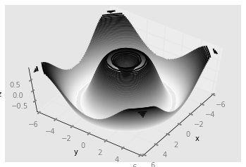

#### 4.14.3 线框图和曲面图

还有两种画网格数据的三维图没有介绍，就是线框图和曲面图。它们都 是将网格数据映射成三维曲面，得到的三维形状非常容易可视化。

下面是一个线框图示例:

```python
In[24]: fig = plt.figure()
        ax = plt.axes(projection='3d') 
        ax.plot_wireframe(X, Y, Z, color='black') 
        ax.set_title('wireframe');
```


曲面图与线框图类似，只不过线框图的每个面都是由多边形构成的。只 要增加一个配色方案来填充这些多边形，就可以让读者感受到可视化图 形表面的拓扑结构了:

```python
In[25]: ax = plt.axes(projection='3d') 
        ax.plot_surface(X, Y, Z, rstride=1, cstride=1,cmap='viridis', edgecolor='none') 
        ax.set_title('surface');
```

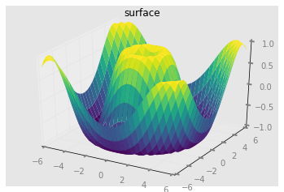

需要注意的是，画曲面图需要二维数据，但可以不是直角坐标系(也可以用极坐标)。

```python
In[26]: r = np.linspace(0, 6, 20)
        theta = np.linspace(-0.9 * np.pi, 0.8 * np.pi, 40) 
        r, theta = np.meshgrid(r, theta)
        X = r * np.sin(theta) 
        Y = r * np.cos(theta) 
        Z = f(X, Y)
        ax = plt.axes(projection='3d') 
        ax.plot_surface(X, Y, Z, rstride=1, cstride=1,
                        cmap='viridis', edgecolor='none');
```

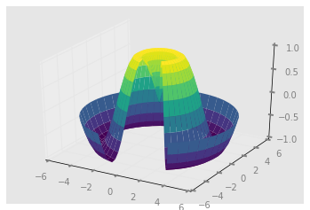

#### 4.14.4 曲面三角剖分

在某些应用场景中，上述这些要求均匀采样的网格数据显得太过严格且 不太容易实现。这时就可以使用三角剖分图形(triangulation-based plot)了。

```python
In[27]: theta = 2 * np.pi * np.random.random(1000) 
        r = 6 * np.random.random(1000)
        x = np.ravel(r * np.sin(theta)) 
        y = np.ravel(r * np.cos(theta)) 
        z = f(x, y)
```

可以先为数据点创建一个散点图，对将要采样的图形有一个基本认识:

```python
In[28]: ax = plt.axes(projection='3d')
        ax.scatter(x, y, z, c=z, cmap='viridis', linewidth=0.5);
```


还有许多地方需要修补，这些工作可以由 ax.plot_trisurf 函数帮助我们完成。它首先找到一组所有点都连接起来的三角形，然后用这些三角形创建曲面:

```python
In[28]: ax = plt.axes(projection='3d') 
        ax.plot_trisurf(x, y, z,
        cmap='viridis', edgecolor='none');
```

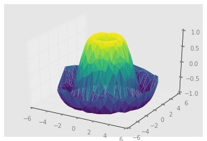

### 4.15 用Basemap可视化地理数据

地理数据可视化是数据科学中一种十分常见的可视化类型。Matplotlib 做此类可视化的主要工具是 Basemap 工具箱，它是 Matplotlib 的 mpl_toolkits 命名空间里的众多工具箱之一。坦白说，Basemap 用起 来有点笨重，就算做点儿简单的可视化图也需要花费比预期更长的时 间。在处理比较复杂的地图可视化任务时，更现代的解决方案可能会更 适用一些，比如 leaflet 开发库或 Google Maps API。然而，Basemap 符 合 Python 用户的使用习惯。

Basemap 安装起来很简单。`conda install basemap`

*如果在 Python 3.6 版运行这条命令失效的话，就用 `conda-forge:conda install basemap -c conda-forge`。*

### 4.16 用Seaborn做数据可视化

虽然 Matplotlib 已经证明了自己绝对是一款超级实用且流行的数据可视化工具，但是即使骨灰粉也不得不承认它不支持的功能还有很多。 Matplotlib 的三条主要“罪状”总结如下。

1. Matplotlib 2.0 之前版本的默认配置样式绝对不是用户的最佳选择。 之前的默认样式还是仿照 1999 年前后的 MATLAB，却一直在使用。
2. Matplotlib 的 API 比较底层。虽然可以实现复杂的统计数据可视化，但是通常都需要写大量的样板代码(boilerplate code)。
3. 由于 Matplotlib 比 Pandas 早十几年，因此它并不是为 Pandas 的 DataFrame 设计的。为了实现 Pandas 的 DataFrame 数据的可视化，你必须先提取每个 Series，然后通常还需要将它们合并成适当的格式。如果有一个画图程序库可以智能地使用 DataFrame 的 标签画图，那一定会很棒。

这些问题的终结者就是 [Seaborn](http://seaborn.pydata.org)。Seaborn 在 Matplotlib 的基础上开发了一套 API，为默认的图形样式和颜色设置提 供了理智的选择，为常用的统计图形定义了许多简单的高级函数，并与 Pandas DataFrame 的功能有机结合。

