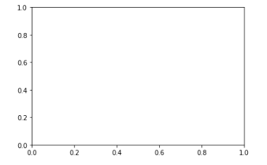
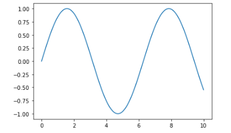
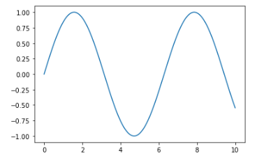
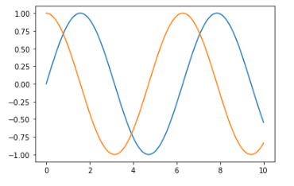
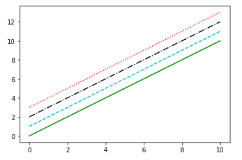
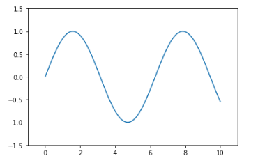
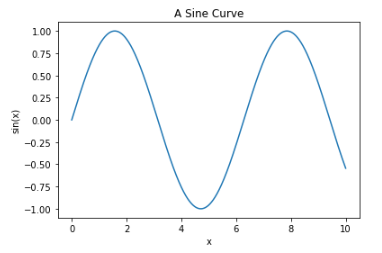
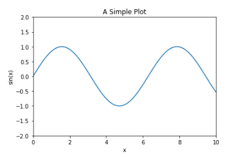

# Python 数据科学手册

[返回](./index.md)

[toc]

## 第 4 章 Matplotlib数据可视化

本章将详细介绍使用 Python 的 Matplotlib 工具实现数据可视化的方法。

### 4.1 Matplotlib常用技巧

#### 4.1.1 导入Matplotlib

```python
In[1]:  import matplotlib as mpl
        import matplotlib.pyplot as plt
```

#### 4.1.2 设置绘图样式

```python
In[2]: plt.style.use('classic')
```

#### 4.1.3 用不用show()？ 如何显示图形

01. 在脚本中画图
    如果你在一个脚本文件中使用 Matplotlib， 那么显示图形的时候必须使用 `plt.show()`。
    一个 Python 会话（session） 中只能使用一次 `plt.show()`， 因此通常都把它放在脚本的最后。 多个`plt.show()` 命令会导致难以预料的显示异常。

02. 在IPython shell中画图

    在 IPython shell 中交互式地使用 Matplotlib 画图非常方便， 在 IPython 启动 Matplotlib 模式就可以使用它。

    ```python
    In [1]: %matplotlib
    Using matplotlib backend: TkAgg
    In [2]: import matplotlib.pyplot as plt
    ```

    此后的任何 plt 命令都会自动打开一个图形窗口， 增加新的命令，图形就会更新。

03. 在IPython Notebook中画图
    你可以将图形直接嵌在 IPythonNotebook 页面中， 有两种展现形式。
    * `%matplotlib notebook` 会在 Notebook 中启动交互式图形。
    * `%matplotlib inline` 会在 Notebook 中启动静态图形。
    本书统一使用 %matplotlib inline：

#### 4.1.4 将图形保存为文件

Matplotlib 的一个优点是能够将图形保存为各种不同的数据格式。

```python
In[5]: fig.savefig('my_figure.png')
```

可以用 IPython 的 Image对象来显示文件内容：

```python
In[7]: from IPython.display import Image
Image('my_figure.png')
```

在 savefig() 里面， 保存的图片文件格式就是文件的扩展名。你可以通过 canvas 对象的方法查看系统支持的文件格式：

```python
In[8]: fig.canvas.get_supported_filetypes()
Out[8]:{'eps': 'Encapsulated Postscript',
        'jpeg': 'Joint Photographic Experts Group',
        'jpg': 'Joint Photographic Experts Group',
        'pdf': 'Portable Document Format',
        'pgf': 'PGF code for LaTeX',
        'png': 'Portable Network Graphics',
        'ps': 'Postscript',
        'raw': 'Raw RGBA bitmap',
        'rgba': 'Raw RGBA bitmap',
        'svg': 'Scalable Vector Graphics',
        'svgz': 'Scalable Vector Graphics',
        'tif': 'Tagged Image File Format',
        'tiff': 'Tagged Image File Format'}
```

当你保存图形文件时， 不需要使用 plt.show() 或者前面介绍过的命令。

### 4.2 两种画图接口

Matplotlibe有两种画图接口：一个是便捷的 MATLAB 风格接口， 另一个是功能更强大的面向对象接口。

#### 4.2.1 MATLAB风格接口

```python
In[9]:  plt.figure() # 创建图形
        # 创建两个子图中的第一个， 设置坐标轴
        plt.subplot(2, 1, 1) # (行、 列、 子图编号)
        plt.plot(x, np.sin(x))

        # 创建两个子图中的第二个， 设置坐标轴
        plt.subplot(2, 1, 2)
        plt.plot(x, np.cos(x))
```


这种接口最重要的特性是有状态的（stateful） ： 它会持续跟踪“当前的”图形和坐标轴， 所有 plt 命令都可以应用。

#### 4.2.2 面向对象接口

面向对象接口可以适应更复杂的场景， 更好地控制你自己的图形。

```python
In[10]: # 先创建图形网格
        # ax是一个包含两个Axes对象的数组
        fig, ax = plt.subplots(2)

        # 在每个对象上调用plot()方法
        ax[0].plot(x, np.sin(x))
        ax[1].plot(x, np.cos(x))
```


### 4.3 简易线形图

```python
In[1]:  %matplotlib inline
        # 导入必须的库
        import matplotlib.pyplot as plt
        plt.style.use('seaborn-whitegrid')
        import numpy as np
```

```python
        # 创建一个图形 fig 和一个坐标轴ax
In[2]:  fig = plt.figure()
        ax = plt.axes()
```



```python
        # 一组简单的正弦曲线（sinusoid）
In[3]:  fig = plt.figure()
        ax = plt.axes()
        x = np.linspace(0, 10, 1000)
        ax.plot(x, np.sin(x))
```



```python
        # 也可以用 pylab 接口画图
In[4]:  plt.plot(x, np.sin(x))
```



```python
        # 如果想在一张图中创建多条线， 可以重复调用 plot 命令
In[5]:  plt.plot(x, np.sin(x))
        plt.plot(x, np.cos(x))
```



#### 4.3.1 调整图形： 线条的颜色与风格

`plt.plot()` 函数可以通过相应的参数设置颜色与风格。

```python
In[6]:
plt.plot(x, np.sin(x - 0), color='blue') # 标准颜色名称
plt.plot(x, np.sin(x - 1), color='g') # 缩写颜色代码（rgbcmyk）
plt.plot(x, np.sin(x - 2), color='0.75') # 范围在0~1的灰度值
plt.plot(x, np.sin(x - 3), color='#FFDD44') # 十六进制（RRGGBB， 00~FF）
plt.plot(x, np.sin(x - 4), color=(1.0,0.2,0.3)) # RGB元组， 范围在0~1
plt.plot(x, np.sin(x - 5), color='chartreuse'); # HTML颜色名称
```


也可以用 linestyle 调整线条的风格

```python
In[7]:  plt.plot(x, x + 0, linestyle='solid')
        plt.plot(x, x + 1, linestyle='dashed')
        plt.plot(x, x + 2, linestyle='dashdot')
        plt.plot(x, x + 3, linestyle='dotted')

        # 你可以用下面的简写形式
        plt.plot(x, x + 4, linestyle='-') # 实线
        plt.plot(x, x + 5, linestyle='--') # 虚线
        plt.plot(x, x + 6, linestyle='-.') # 点划线
        plt.plot(x, x + 7, linestyle=':'); # 实点线
```


可以将 linestyle 和 color 编码组合起来

```python
In[8]:  plt.plot(x, x + 0, '-g') # 绿色实线
        plt.plot(x, x + 1, '--c') # 青色虚线
        plt.plot(x, x + 2, '-.k') # 黑色点划线
        plt.plot(x, x + 3, ':r'); # 红色实点线
```



#### 4.3.2 调整图形： 坐标轴上下限

调整坐标轴上下限最基础的方法是`plt.xlim()` 和 `plt.ylim()`

```python
In[9]: plt.plot(x, np.sin(x))
plt.xlim(-1, 11)
plt.ylim(-1.5, 1.5)
```


也可以逆序设置坐标轴刻度值

```python
In[10]: plt.plot(x, np.sin(x))
        plt.xlim(10, 0)
        plt.ylim(1.2, -1.2)
```


还有一个方法是 `plt.axis()`

```python
In[11]: plt.plot(x, np.sin(x))
        plt.axis([-1, 11, -1.5, 1.5])
```



`plt.axis()` 还可以按照图形的内容自动收紧坐标轴， 不留空白区域

```python
In[12]: plt.plot(x, np.sin(x))
        plt.axis('tight')
```


你还可以实现更高级的配置， 例如让屏幕上显示的图形分辨率为 1:1

```python
In[13]: plt.plot(x, np.sin(x))
        plt.axis('equal')
```


#### 4.3.3 设置图形标签

快速设置图形标题与坐标轴标题

```python
In[14]: plt.plot(x, np.sin(x))
plt.title("A Sine Curve")
plt.xlabel("x")
plt.ylabel("sin(x)")
```



Matplotlib 内置了一个简单快速的方法， 可以用来创建图例， 那就是 `plt.legend()`

```python
In[15]: plt.plot(x, np.sin(x), '-g', label='sin(x)')
        plt.plot(x, np.cos(x), ':b', label='cos(x)')
        plt.axis('equal')
        plt.legend()
```


虽然绝大多数的 plt 函数都可以直接转换成 ax 方法（例如`plt.plot()` → `ax.plot()`、 `plt.legend()` → `ax.legend()`等） ， 但是并非所有的命令都可以这样用。 尤其是用来设置坐标轴上下限、 坐标轴标题和图形标题的函数， 它们大都稍有差别。 一些MATLAB 风格的方法和面向对象方法的转换如下所示：

* plt.xlabel() → ax.set_xlabel()
* plt.ylabel() → ax.set_ylabel()
* plt.xlim() → ax.set_xlim()
* plt.ylim() → ax.set_ylim()
* plt.title() → ax.set_title()

采用ax.set() 方法一次性设置所有的属性是更简便的方法

```python
In[16]: ax = plt.axes()
        ax.plot(x, np.sin(x))
        ax.set(xlim=(0, 10), ylim=(-2, 2),
        xlabel='x', ylabel='sin(x)',
        title='A Simple Plot')
```


