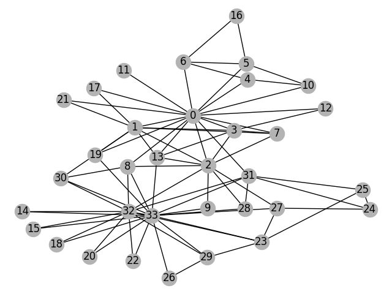
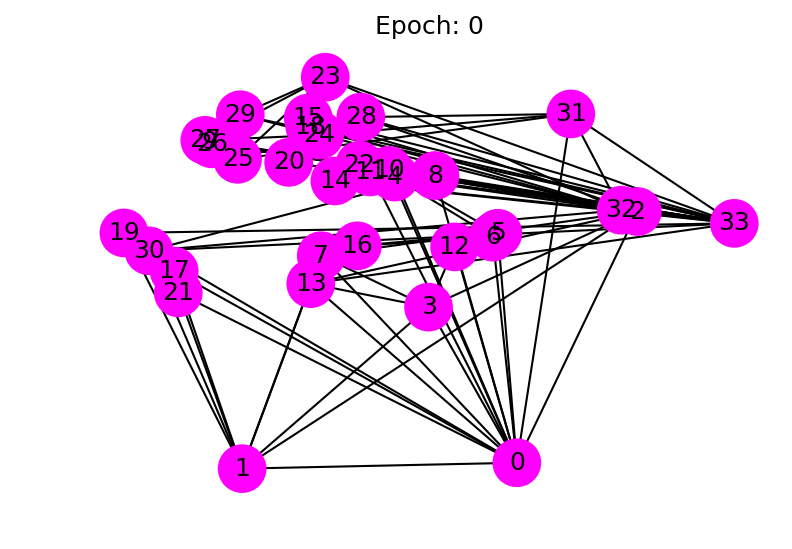

# DGL概览

DGL是一个Python软件包, 致力于在图上进行深度学习, 它建立在现有的张量DL框架(例如Pytorch，MXNet)之上, 并简化了基于图的神经网络的实现.

本教程的目标:

* 了解DGL如何从高层次进行图形计算.
* 在DGL中训练一个简单的图神经网络以对图中的节点进行分类.

在本教程的最后, 我们希望您对DGL的工作方式有一个简要的了解.

本教程假定您对pytorch基本熟悉.

## 教程问题描述

本教程基于"Zachary’s karate club"问题. 空手道俱乐部是一个社交网络, 包括34个成员, 并在俱乐部外有互动的成员之间建立成对链接. 俱乐部随后分为两个社区, 由教员（节点0）和俱乐部主席（节点33）领导. 网络以如下方式可视化, 并带有表示社区的颜色:


任务是给定社交网络本身, 预测每个成员倾向于加入哪一侧(0或33).

## 第一步: 在DGL中创建一个图

如下创建"Zachary’s karate club"的图:

```python
import dgl
import numpy as np

def build_karate_club_graph():
    # All 78 edges are stored in two numpy arrays. One for source endpoints
    # while the other for destination endpoints.
    src = np.array([1, 2, 2, 3, 3, 3, 4, 5, 6, 6, 6, 7, 7, 7, 7, 8, 8, 9, 10, 10,
        10, 11, 12, 12, 13, 13, 13, 13, 16, 16, 17, 17, 19, 19, 21, 21,
        25, 25, 27, 27, 27, 28, 29, 29, 30, 30, 31, 31, 31, 31, 32, 32,
        32, 32, 32, 32, 32, 32, 32, 32, 32, 33, 33, 33, 33, 33, 33, 33,
        33, 33, 33, 33, 33, 33, 33, 33, 33, 33])
    dst = np.array([0, 0, 1, 0, 1, 2, 0, 0, 0, 4, 5, 0, 1, 2, 3, 0, 2, 2, 0, 4,
        5, 0, 0, 3, 0, 1, 2, 3, 5, 6, 0, 1, 0, 1, 0, 1, 23, 24, 2, 23,
        24, 2, 23, 26, 1, 8, 0, 24, 25, 28, 2, 8, 14, 15, 18, 20, 22, 23,
        29, 30, 31, 8, 9, 13, 14, 15, 18, 19, 20, 22, 23, 26, 27, 28, 29, 30,
        31, 32])
    # Edges are directional in DGL; Make them bi-directional.
    u = np.concatenate([src, dst])
    v = np.concatenate([dst, src])
    # Construct a DGLGraph
    return dgl.DGLGraph((u, v))
```

在我们新建的图形中打印出节点和边的数量:

```python
G = build_karate_club_graph()
print('We have %d nodes.' % G.number_of_nodes())
print('We have %d edges.' % G.number_of_edges())

```

Out:

```text
/home/ubuntu/james_dgl/python/dgl/base.py:45: DGLWarning: Recommend creating graphs by `dgl.graph(data)` instead of `dgl.DGLGraph(data)`.
return warnings.warn(message, category=category, stacklevel=1)
We have 34 nodes.
We have 156 edges.
```

通过将其转换为[networkx](https://networkx.github.io/documentation/stable/)图来可视化该图:

```python
import networkx as nx
# Since the actual graph is undirected, we convert it for visualization
# purpose.
nx_G = G.to_networkx().to_undirected()
# Kamada-Kawaii layout usually looks pretty for arbitrary graphs
pos = nx.kamada_kawai_layout(nx_G)
nx.draw(nx_G, pos, with_labels=True, node_color=[[.7, .7, .7]])
```



## 第二步: 将特征分配给节点或边

图神经网络将特征与节点和边关联以进行训练. 对于我们的分类示例, 由于没有输入功能, 因此我们为每个节点分配了可学习的嵌入向量.

```python
# In DGL, you can add features for all nodes at once, using a feature tensor that
# batches node features along the first dimension. The code below adds the learnable
# embeddings for all nodes:

import torch
import torch.nn as nn
import torch.nn.functional as F

embed = nn.Embedding(34, 5)  # 34 nodes with embedding dim equal to 5
G.ndata['feat'] = embed.weight
```

打印出节点特征以进行验证:

```python
# print out node 2's input feature
print(G.ndata['feat'][2])

# print out node 10 and 11's input features
print(G.ndata['feat'][[10, 11]])
```

Out:

```text
tensor([-1.6875, -0.7502,  1.0488, -0.1057, -0.8941], grad_fn=<SelectBackward>)
tensor([[-0.4210,  0.5514,  0.7893,  1.0529,  0.1141],
        [-0.7574, -1.0227, -0.4702, -0.9267, -1.6494]],
       grad_fn=<IndexBackward>)
```

## 第三步: 定义一个图卷积网络(GCN)

要执行节点分类, 请使用[Kipf和Welling](https://arxiv.org/abs/1609.02907)开发的图卷积网络(GCN). 这是GCN框架的最简单定义. 我们建议您阅读原始文章以获取更多详细信息. 我们建议您阅读原始文章以获取更多详细信息.

* 在层$l$上，每个节点$𝑣^𝑙_𝑖$携带特征向量$ℎ^𝑙_𝑖$.
* GCN的每一层都尝试将$𝑢^𝑙_𝑖$(其中$𝑢_i$是邻域节点)的特征要素聚合到下一层的表示$𝑣^{𝑙+1}_𝑖$中。随后是具有某些非线性的仿射变换。

上面的GCN定义适用于消息传递范例: 每个节点将使用从相邻节点发送的信息来更新其自身的功能. 下面显示了图形演示.


在DGL中, 我们在`dgl.<backend>.nn`子包中提供了常用的图神经网络层的实现. `GraphConv`模块实现了一个图卷积层.

```python
from dgl.nn.pytorch import GraphConv
```

定义一个包含了两个GCN层的深度GCN模型:

```python
class GCN(nn.Module):
    def __init__(self, in_feats, hidden_size, num_classes):
        super(GCN, self).__init__()
        self.conv1 = GraphConv(in_feats, hidden_size)
        self.conv2 = GraphConv(hidden_size, num_classes)

    def forward(self, g, inputs):
        h = self.conv1(g, inputs)
        h = torch.relu(h)
        h = self.conv2(g, h)
        return h

# The first layer transforms input features of size of 5 to a hidden size of 5.
# The second layer transforms the hidden layer and produces output features of
# size 2, corresponding to the two groups of the karate club.
net = GCN(5, 5, 2)
```

## 第四步: 数据准备和初始化

我们使用可学习的嵌入来初始化节点特征. 由于这是半​​监督设置, 因此仅为教练(节点0)和俱乐部主席(节点33)分配标签.该实现如下:

```python
inputs = embed.weight
labeled_nodes = torch.tensor([0, 33])  # only the instructor and the president nodes are labeled
labels = torch.tensor([0, 1])  # their labels are different
```

## 第五步: 训练及可视化

训练循环与其他PyTorch模型完全相同. 我们(1)创建一个优化器, (2)将输入提供给模型, (3)计算损失, (4)使用autograd优化模型.

```python
import itertools

optimizer = torch.optim.Adam(itertools.chain(net.parameters(), embed.parameters()), lr=0.01)
all_logits = []
for epoch in range(50):
    logits = net(G, inputs)
    # we save the logits for visualization later
    all_logits.append(logits.detach())
    logp = F.log_softmax(logits, 1)
    # we only compute loss for labeled nodes
    loss = F.nll_loss(logp[labeled_nodes], labels)

    optimizer.zero_grad()
    loss.backward()
    optimizer.step()

    print('Epoch %d | Loss: %.4f' % (epoch, loss.item()))
```

Out:

```text
Epoch 0 | Loss: 0.8101
Epoch 1 | Loss: 0.7879
...
Epoch 48 | Loss: 0.1260
Epoch 49 | Loss: 0.1119
```

这是一个很有趣的例子, 因此甚至没有验证或测试集. 相反, 由于模型为每个节点生成大小为2的输出特征, 因此我们可以通过在2D空间中绘制输出特征来可视化. 以下代码使训练过程从最初的猜测(根本没有对节点进行正确分类)到最终的结果(使节点线性可分离)动画化.

```python
import matplotlib.animation as animation
import matplotlib.pyplot as plt

def draw(i):
    cls1color = '#00FFFF'
    cls2color = '#FF00FF'
    pos = {}
    colors = []
    for v in range(34):
        pos[v] = all_logits[i][v].numpy()
        cls = pos[v].argmax()
        colors.append(cls1color if cls else cls2color)
    ax.cla()
    ax.axis('off')
    ax.set_title('Epoch: %d' % i)
    nx.draw_networkx(nx_G.to_undirected(), pos, node_color=colors,
            with_labels=True, node_size=300, ax=ax)

fig = plt.figure(dpi=150)
fig.clf()
ax = fig.subplots()
draw(0)  # draw the prediction of the first epoch
plt.close()
```



以下动画显示了经过一系列训练后, 模型如何正确预测社区.


## Next steps

在下一个教程中, 我们将介绍DGL的更多基础知识, 例如读写节点/边功能.

脚本的总运行时间: 0分钟0.656秒
[下载Python源代码](asset/1_first.py)
[下载Jupyter Notebook](asset/1_first.ipynb)