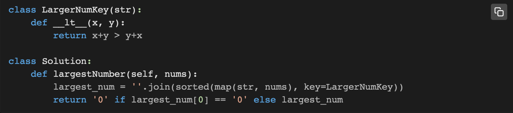
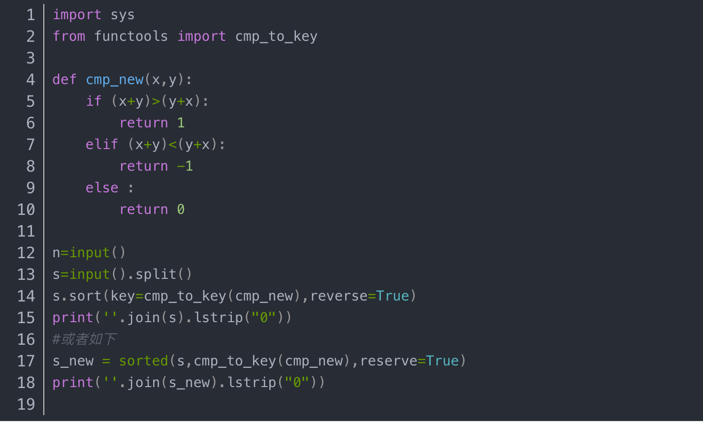

# Note

## go 默认浏览器打开指定网页

``` go
// open opens the specified URL in the default browser of the user.
func open(url string) error {
    var cmd string
    var args []string

    switch runtime.GOOS {
    case "windows":
        cmd = "cmd"
        args = []string{"/c", "start"}
    case "darwin":
        cmd = "open"
    default: // "linux", "freebsd", "openbsd", "netbsd"
        cmd = "xdg-open"
    }
    args = append(args, url)
    return exec.Command(cmd, args...).Start()
}
```

## Python 的 [:] 切片会产生浅复制

## docker for mac 访问主机地址

host.docker.internal

## 搜索下载库文件所在的软件包

http://www.rpmfind.net/

## 为什么L1正则化比L2正则化更容易产生稀疏解？

...

## KD-Tree

...

## 复杂度表示


### 递推式复杂度


## python比较函数





## 堆排序

