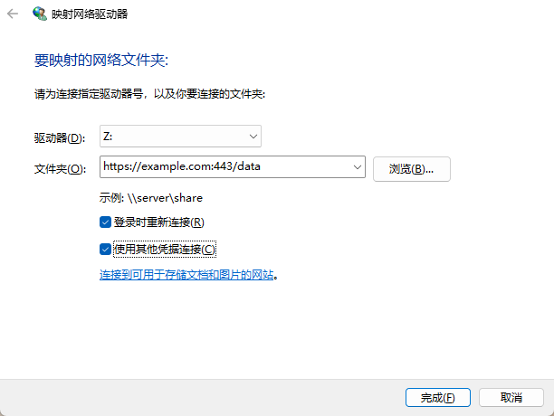
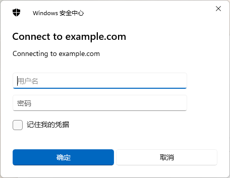
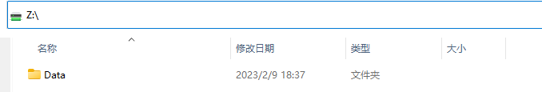
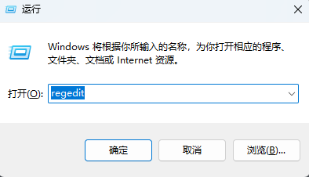
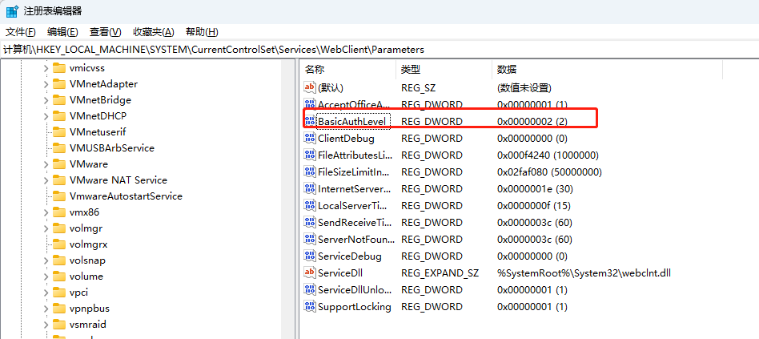
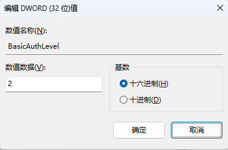
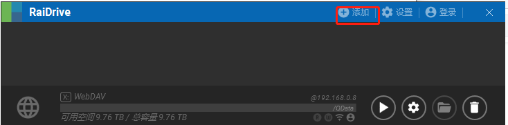
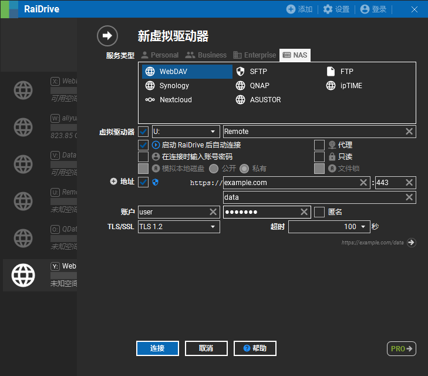
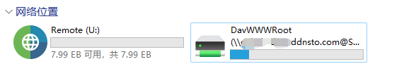

# Windows添加WebDAV网络硬盘

## WebDAV
WebDAV （Web-based Distributed Authoring and Versioning） 一种基于 HTTP 1.1协议的通信协议。它扩展了HTTP 1.1，在GET、POST、HEAD等几个HTTP标准方法以外添加了一些新的方法，使应用程序可对Web Server直接读写，并支持写文件锁定(Locking)及解锁(Unlock)，还可以支持文件的版本控制。   简单说，WebDAV也是http(https)协议的链接，但是可以添加到文件系统，当成一个硬盘来使用。 介绍两种Windows连接WebDAV的方式，推荐RaiDrive，可以直接播放网络硬盘里的视频

## 使用Windows系统功能连接WebDAV

1. 在“我的电脑”上点击鼠标右键， 选择“映射网络驱动器”
2. 在弹出的窗口里选择驱动器号，文件夹填写链接，可以指定子文件夹

3. 继续输入凭据

4. 成功连接后就会变成一个“我的电脑”下的一个磁盘，文件路径和本地硬盘一样

### Windows下连接http协议的WebDAV出错
 Windows的WebDAV默认只支持https协议，如果添加http协议的WebDAV出错需要修改注册表

1. 同时按下键盘的“Win+R”键弹出运行窗口，输入 “regedit”选确定打开注册表 

2. 修改之前可以选择“文件->导出”将旧的配置备份
3. 在注册表的地址栏输入下面地址
>   计算机\HKEY_LOCAL_MACHINE\SYSTEM\CurrentControlSet\Services\WebClient\Parameters

4. 修改【BasicAuthLevel】的值为【2】，表示同时支持https和http两种协议

 

## 使用RaiDrive连接WebDAV
如果Windows自带的WebDAV工具不好用，或者连接不了， 可以尝试使用[RaiDrive](https://www.raidrive.com/)

1. 到RaiDrive官网下载软件，安装后打开，点击顶部“添加”

2. 在弹出的窗口选择“NAS->WebDAV”,输入配置， 这里如果选择“在连接时输入密码”，则需要在每次连接都要重新输入凭据，以及“地址”后面的选择框是决定地址是否https的

3. 下图是RaiDrive和Windows工具连接后的情况，虽然RaiDrive可以修改驱动器名， 但实际使用地址都是卷标，所以影响不大

另外RaiDrive也支持添加其他类型的网络驱动器，包括同步部分云网盘，可以自行研究
